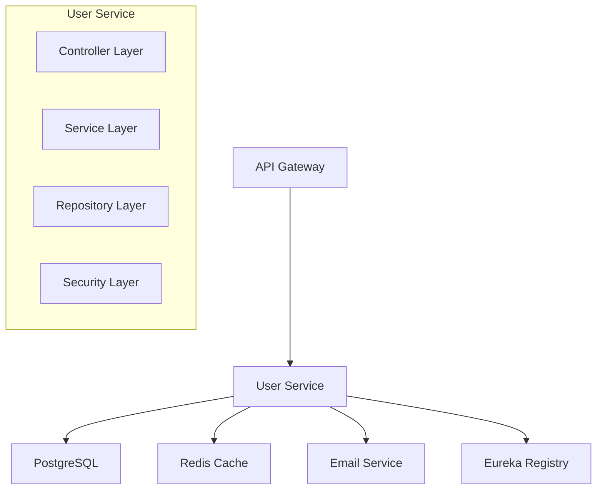
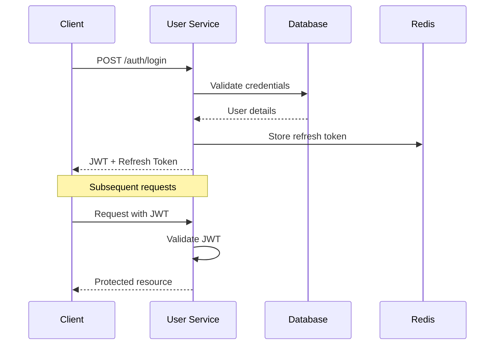

# 🔐 User Authentication Service

[]()
[]()
[]()
[]()

A robust microservice for user authentication, authorization, and profile management built with Spring Boot.

## 📋 Table of Contents

- [Overview](#-overview)
- [Features](#-features)
- [Architecture](#️-architecture)
- [Quick Start](#-quick-start)
- [API Documentation](#-api-documentation)
- [Configuration](#-configuration)
- [Database](#️-database)
- [Security](#-security)
- [Testing](#-testing)
- [Deployment](#-deployment)
- [Monitoring](#-monitoring)
- [Troubleshooting](#-troubleshooting)
- [Contributing](#-contributing)

## 🎯 Overview

The User Authentication Service is a Spring Boot microservice that provides comprehensive user management capabilities for modern applications. It offers secure authentication, authorization, and user profile management with JWT token support.

### Key Responsibilities
- User registration and authentication
- JWT token generation and validation
- Role-based access control (RBAC)
- User profile management
- Password reset functionality
- Session management

## ✨ Features

- 🔒 **Secure Authentication** - JWT-based authentication with refresh tokens
- 👥 **User Management** - Complete CRUD operations for user profiles
- 🛡️ **Authorization** - Role-based access control (RBAC)
- 🔄 **Password Reset** - Secure password reset via email
- 📧 **Email Verification** - Account verification workflow
- 🚦 **Rate Limiting** - Protection against brute force attacks
- 📊 **Health Monitoring** - Built-in health checks and metrics
- 🐳 **Docker Support** - Containerized deployment ready

## 🏗️ Architecture



### Technology Stack
- **Framework**: Spring Boot 3.2+
- **Security**: Spring Security 6+ with JWT
- **Database**: PostgreSQL 15+
- **Cache**: Redis 7+
- **Service Discovery**: Eureka
- **Documentation**: OpenAPI 3.0 (Swagger)
- **Testing**: JUnit 5, Testcontainers

## 🚀 Quick Start

### Prerequisites
- Java 17 or higher
- Maven 3.8+
- Docker & Docker Compose
- PostgreSQL 15+ (or use Docker)

### 🐳 Docker Deployment (Recommended)

```bash
# Clone the repository
git clone https://github.com/your-org/user-service.git
cd user-service

# Start all services with Docker Compose
docker-compose up -d

# Verify service is running
curl http://localhost:8082/actuator/health
```

### 🛠️ Local Development

```bash
# Install dependencies
mvn clean install

# Run tests
mvn test

# Start PostgreSQL (if not using Docker)
docker run -d --name postgres \
  -e POSTGRES_DB=userdb \
  -e POSTGRES_USER=admin \
  -e POSTGRES_PASSWORD=password \
  -p 5432:5432 postgres:15

# Start the application
mvn spring-boot:run -Dspring-boot.run.profiles=dev
```

### 🌐 Access Points

| Service | URL | Description |
|---------|-----|-------------|
| **API Base** | `http://localhost:8082` | Main service endpoint |
| **Swagger UI** | `http://localhost:8082/swagger-ui/index.html` | Interactive API documentation |
| **Health Check** | `http://localhost:8082/actuator/health` | Service health status |
| **Metrics** | `http://localhost:8082/actuator/metrics` | Service metrics |

## 📖 API Documentation

### 🔐 Authentication Endpoints

| Method | Endpoint | Description | Request Body |
|--------|----------|-------------|--------------|
| `POST` | `/api/v1/auth/register` | Register new user | [UserRegistrationRequest](#userregistrationrequest) |
| `POST` | `/api/v1/auth/login` | User login | [LoginRequest](#loginrequest) |
| `POST` | `/api/v1/auth/refresh` | Refresh JWT token | [RefreshTokenRequest](#refreshtokenrequest) |
| `POST` | `/api/v1/auth/logout` | User logout | - |
| `POST` | `/api/v1/auth/forgot-password` | Request password reset | [ForgotPasswordRequest](#forgotpasswordrequest) |
| `POST` | `/api/v1/auth/reset-password` | Reset password | [ResetPasswordRequest](#resetpasswordrequest) |

### 👤 User Management Endpoints

| Method | Endpoint | Description | Auth Required | Role |
|--------|----------|-------------|---------------|------|
| `GET` | `/api/v1/users/profile` | Get current user profile | ✅ | USER |
| `PUT` | `/api/v1/users/profile` | Update user profile | ✅ | USER |
| `DELETE` | `/api/v1/users/profile` | Delete user account | ✅ | USER |
| `GET` | `/api/v1/users/{id}` | Get user by ID | ✅ | ADMIN |
| `GET` | `/api/v1/users` | Get all users (paginated) | ✅ | ADMIN |

### 📋 Request/Response Examples

#### UserRegistrationRequest
```json
{
  "username": "johndoe",
  "email": "john@example.com",
  "password": "SecurePassword123!",
  "firstName": "John",
  "lastName": "Doe"
}
```

#### LoginResponse
```json
{
  "accessToken": "eyJhbGciOiJIUzI1NiIs...",
  "refreshToken": "eyJhbGciOiJIUzI1NiIs...",
  "tokenType": "Bearer",
  "expiresIn": 3600,
  "user": {
    "id": "550e8400-e29b-41d4-a716-446655440000",
    "username": "johndoe",
    "email": "john@example.com",
    "firstName": "John",
    "lastName": "Doe",
    "role": "USER",
    "emailVerified": true,
    "createdAt": "2025-06-17T10:30:00Z"
  }
}
```

> 📚 **Complete API Documentation**: Visit [Swagger UI](http://localhost:8082/swagger-ui/index.html) for interactive API documentation.

## ⚙️ Configuration

### Environment Variables

Create a `.env` file in the project root:

```bash
# Database Configuration
DB_HOST=localhost
DB_PORT=5432
DB_NAME=userdb
DB_USERNAME=admin
DB_PASSWORD=your_secure_password

# JWT Configuration
JWT_SECRET=your-256-bit-secret-key-here
JWT_EXPIRATION=86400000
JWT_REFRESH_EXPIRATION=604800000

# Redis Configuration
REDIS_HOST=localhost
REDIS_PORT=6379
REDIS_PASSWORD=

# Email Configuration
SMTP_HOST=smtp.gmail.com
SMTP_PORT=587
SMTP_USERNAME=your-email@example.com
SMTP_PASSWORD=your-app-password

# Service Discovery
EUREKA_SERVER_URL=http://localhost:8761/eureka

# Logging
LOG_LEVEL=INFO
```

### Application Configuration

```yaml
# application.yml
server:
  port: 8082
  servlet:
    context-path: /

spring:
  application:
    name: user-service
  
  profiles:
    active: ${SPRING_PROFILES_ACTIVE:dev}
  
  datasource:
    url: jdbc:postgresql://${DB_HOST:localhost}:${DB_PORT:5432}/${DB_NAME:userdb}
    username: ${DB_USERNAME:admin}
    password: ${DB_PASSWORD:password}
    driver-class-name: org.postgresql.Driver
  
  jpa:
    hibernate:
      ddl-auto: validate
    show-sql: false
    properties:
      hibernate:
        dialect: org.hibernate.dialect.PostgreSQLDialect
        format_sql: true

  redis:
    host: ${REDIS_HOST:localhost}
    port: ${REDIS_PORT:6379}
    password: ${REDIS_PASSWORD:}
    timeout: 2000ms

  liquibase:
    change-log: classpath:db/changelog/db.changelog-master.xml

# JWT Configuration
jwt:
  secret: ${JWT_SECRET:default-secret-key}
  expiration: ${JWT_EXPIRATION:86400000}
  refresh-expiration: ${JWT_REFRESH_EXPIRATION:604800000}

# Management and Monitoring
management:
  endpoints:
    web:
      exposure:
        include: health,info,metrics,prometheus
  endpoint:
    health:
      show-details: always

# Eureka Configuration
eureka:
  client:
    service-url:
      defaultZone: ${EUREKA_SERVER_URL:http://localhost:8761/eureka/}
  instance:
    prefer-ip-address: true
    health-check-url-path: /actuator/health

# Logging
logging:
  level:
    com.yourcompany.userservice: ${LOG_LEVEL:INFO}
    org.springframework.security: WARN
    org.hibernate.SQL: DEBUG
  pattern:
    console: "%d{yyyy-MM-dd HH:mm:ss} - %msg%n"
```

## 🗄️ Database

### Schema Overview

```sql
-- Users table
CREATE TABLE users (
    id UUID PRIMARY KEY DEFAULT gen_random_uuid(),
    username VARCHAR(50) UNIQUE NOT NULL,
    email VARCHAR(100) UNIQUE NOT NULL,
    password_hash VARCHAR(255) NOT NULL,
    first_name VARCHAR(50) NOT NULL,
    last_name VARCHAR(50) NOT NULL,
    role VARCHAR(20) DEFAULT 'USER',
    is_active BOOLEAN DEFAULT true,
    email_verified BOOLEAN DEFAULT false,
    created_at TIMESTAMP DEFAULT CURRENT_TIMESTAMP,
    updated_at TIMESTAMP DEFAULT CURRENT_TIMESTAMP
);

-- Refresh tokens table
CREATE TABLE refresh_tokens (
    id UUID PRIMARY KEY DEFAULT gen_random_uuid(),
    user_id UUID NOT NULL REFERENCES users(id) ON DELETE CASCADE,
    token_hash VARCHAR(255) UNIQUE NOT NULL,
    expires_at TIMESTAMP NOT NULL,
    created_at TIMESTAMP DEFAULT CURRENT_TIMESTAMP
);

-- Password reset tokens table
CREATE TABLE password_reset_tokens (
    id UUID PRIMARY KEY DEFAULT gen_random_uuid(),
    user_id UUID NOT NULL REFERENCES users(id) ON DELETE CASCADE,
    token VARCHAR(255) UNIQUE NOT NULL,
    expires_at TIMESTAMP NOT NULL,
    used BOOLEAN DEFAULT false,
    created_at TIMESTAMP DEFAULT CURRENT_TIMESTAMP
);

-- Indexes for performance
CREATE INDEX idx_users_email ON users(email);
CREATE INDEX idx_users_username ON users(username);
CREATE INDEX idx_refresh_tokens_user_id ON refresh_tokens(user_id);
CREATE INDEX idx_password_reset_tokens_user_id ON password_reset_tokens(user_id);
```

### Migrations

Database migrations are managed using Liquibase. Migration files are located in `src/main/resources/db/changelog/`.

```bash
# Apply migrations
mvn liquibase:update

# Rollback migrations
mvn liquibase:rollback -Dliquibase.rollbackCount=1
```

## 🔒 Security

### Authentication Flow



### Security Features

- **Password Hashing**: BCrypt with configurable strength
- **JWT Tokens**: Stateless authentication with configurable expiration
- **Refresh Tokens**: Secure token renewal mechanism
- **Rate Limiting**: Configurable rate limits per endpoint
- **CORS**: Cross-origin resource sharing configuration
- **Input Validation**: Comprehensive request validation
- **SQL Injection Protection**: Parameterized queries with JPA

### Rate Limiting Configuration

```yaml
# Rate limiting rules
rate-limit:
  rules:
    - path: "/api/v1/auth/login"
      limit: 5
      window: 60s
    - path: "/api/v1/auth/register"
      limit: 3
      window: 3600s
    - path: "/api/v1/auth/forgot-password"
      limit: 3
      window: 3600s
```

## 🧪 Testing

### Test Structure

```
src/test/java/
├── unit/                    # Unit tests
│   ├── service/            # Service layer tests
│   ├── controller/         # Controller tests
│   └── security/           # Security tests
├── integration/            # Integration tests
│   ├── api/               # API endpoint tests
│   └── repository/        # Database tests
└── e2e/                   # End-to-end tests
```

### Running Tests

```bash
# Run all tests
mvn test

# Run specific test categories
mvn test -Dtest="**/*UnitTest"
mvn test -Dtest="**/*IntegrationTest"

# Run tests with coverage
mvn clean test jacoco:report

# View coverage report
open target/site/jacoco/index.html
```

### Test Configuration

```yaml
# application-test.yml
spring:
  datasource:
    url: jdbc:h2:mem:testdb
    driver-class-name: org.h2.Driver
  jpa:
    hibernate:
      ddl-auto: create-drop
  redis:
    host: localhost
    port: 6370  # Different port for test Redis

jwt:
  secret: test-secret-key
  expiration: 3600000
```

## 🚀 Deployment

### Docker Deployment

```yaml
# docker-compose.yml
version: '3.8'

services:
  user-service:
    build: .
    ports:
      - "8082:8082"
    environment:
      - SPRING_PROFILES_ACTIVE=docker
      - DB_HOST=postgres
      - REDIS_HOST=redis
      - EUREKA_SERVER_URL=http://eureka:8761/eureka/
    depends_on:
      - postgres
      - redis
      - eureka
    networks:
      - app-network

  postgres:
    image: postgres:15-alpine
    environment:
      POSTGRES_DB: userdb
      POSTGRES_USER: admin
      POSTGRES_PASSWORD: password
    volumes:
      - postgres_data:/var/lib/postgresql/data
    networks:
      - app-network

  redis:
    image: redis:7-alpine
    command: redis-server --appendonly yes
    volumes:
      - redis_data:/data
    networks:
      - app-network

volumes:
  postgres_data:
  redis_data:

networks:
  app-network:
    driver: bridge
```

### Kubernetes Deployment

```yaml
# k8s/deployment.yaml
apiVersion: apps/v1
kind: Deployment
metadata:
  name: user-service
spec:
  replicas: 3
  selector:
    matchLabels:
      app: user-service
  template:
    metadata:
      labels:
        app: user-service
    spec:
      containers:
      - name: user-service
        image: user-service:latest
        ports:
        - containerPort: 8082
        env:
        - name: SPRING_PROFILES_ACTIVE
          value: "k8s"
        - name: DB_HOST
          value: "postgres-service"
        livenessProbe:
          httpGet:
            path: /actuator/health
            port: 8082
          initialDelaySeconds: 60
          periodSeconds: 30
        readinessProbe:
          httpGet:
            path: /actuator/health/readiness
            port: 8082
          initialDelaySeconds: 30
          periodSeconds: 10
```

### Production Checklist

- [ ] Environment variables configured
- [ ] Database migrations applied
- [ ] SSL/TLS certificates configured
- [ ] Rate limiting enabled
- [ ] Monitoring and logging configured
- [ ] Backup strategy implemented
- [ ] Security scan completed
- [ ] Performance testing completed

## 📊 Monitoring

### Health Checks

The service provides comprehensive health checks:

```bash
# Overall health
curl http://localhost:8082/actuator/health

# Database connectivity
curl http://localhost:8082/actuator/health/db

# Redis connectivity
curl http://localhost:8082/actuator/health/redis

# Readiness check
curl http://localhost:8082/actuator/health/readiness
```

### Metrics

Key metrics available at `/actuator/metrics`:

- `user.registrations.total` - Total user registrations
- `user.logins.total` - Total login attempts
- `user.logins.successful` - Successful logins
- `jwt.tokens.generated` - JWT tokens generated
- `jwt.tokens.refreshed` - Tokens refreshed

### Logging

```yaml
# Structured logging configuration
logging:
  pattern:
    console: >
      %d{yyyy-MM-dd HH:mm:ss.SSS} [%thread] %-5level [%X{traceId:-},%X{spanId:-}] 
      %logger{36} - %msg%n
  level:
    com.yourcompany.userservice: INFO
    org.springframework.security: WARN
    org.springframework.web: DEBUG
```

## 🐛 Troubleshooting

### Common Issues

#### Database Connection Issues
```bash
# Check database connectivity
docker exec -it postgres psql -U admin -d userdb -c "SELECT 1;"

# View database logs
docker logs postgres
```

#### JWT Token Issues
```bash
# Validate JWT configuration
curl -H "Authorization: Bearer <token>" http://localhost:8082/api/v1/users/profile

# Check token in logs
grep "JWT" logs/user-service.log
```

#### Service Discovery Issues
```bash
# Check Eureka registration
curl http://localhost:8761/eureka/apps/user-service

# Verify service info
curl http://localhost:8082/actuator/info
```

### Debug Mode

Enable debug logging:

```bash
# Start with debug profile
java -jar -Dspring.profiles.active=debug user-service.jar

# Or via environment variable
export SPRING_PROFILES_ACTIVE=debug
mvn spring-boot:run
```

### Log Analysis

```bash
# View recent logs
tail -f logs/user-service.log

# Search for errors
grep -i error logs/user-service.log

# Monitor specific patterns
tail -f logs/user-service.log | grep "Authentication"
```

## 🤝 Contributing

We welcome contributions! Please follow these guidelines:

### Development Workflow

1. **Fork** the repository
2. **Create** a feature branch (`git checkout -b feature/amazing-feature`)
3. **Commit** your changes (`git commit -m 'Add amazing feature'`)
4. **Push** to the branch (`git push origin feature/amazing-feature`)
5. **Open** a Pull Request

### Code Standards

- Follow [Google Java Style Guide](https://google.github.io/styleguide/javaguide.html)
- Write comprehensive tests (minimum 80% coverage)
- Update documentation for API changes
- Use conventional commit messages

### Pull Request Checklist

- [ ] Tests pass (`mvn test`)
- [ ] Code coverage maintained
- [ ] Documentation updated
- [ ] API documentation updated
- [ ] No breaking changes (or clearly documented)
- [ ] Security considerations addressed

---

## 📚 Additional Resources

- [Spring Boot Documentation](https://spring.io/projects/spring-boot)
- [Spring Security Reference](https://docs.spring.io/spring-security/reference/)
- [JWT.io](https://jwt.io/) - JWT token debugger
- [API Design Guidelines](./docs/api-guidelines.md)
- [Deployment Guide](./docs/deployment.md)

## 📞 Support

- **Documentation**: [Project Wiki](https://github.com/your-org/user-service/wiki)
- **Issues**: [GitHub Issues](https://github.com/your-org/user-service/issues)
- **Discussions**: [GitHub Discussions](https://github.com/your-org/user-service/discussions)
- **Email**: support@yourcompany.com

---

**Maintained by**: Platform Team | **Last Updated**: June 17, 2025
